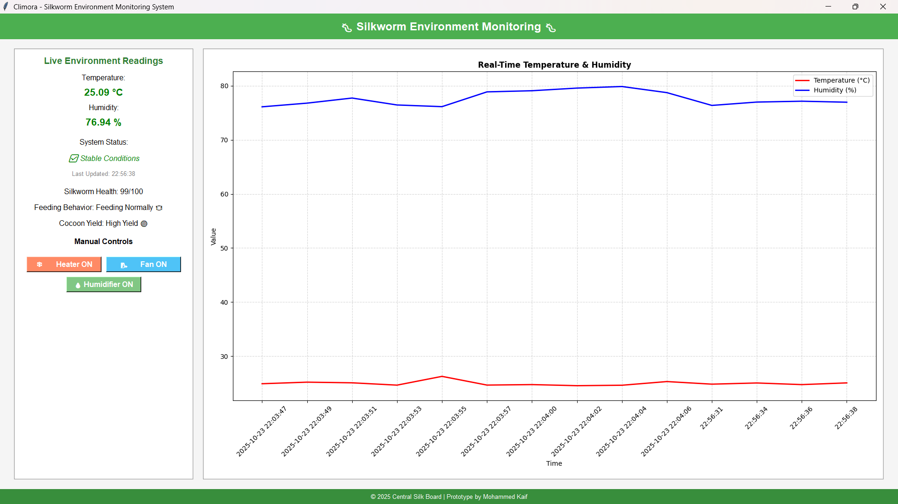

# Silkworm Environment Monitoring System

**IoT-based system for real-time monitoring and automated control of silkworm habitat conditions.**

---

## Overview
Maintaining optimal temperature and humidity is critical for silkworm growth. This system provides:  
- Real-time temperature & humidity monitoring  
- Automated control to maintain ideal conditions  
- Historical data logging for analysis  
- Alerts for out-of-range conditions  

---

## Dashboard Screenshot
  
*Visual representation of real-time monitoring and alerts.*

---
## Technologies
- **Python** | **Flask / FastAPI** | **Uvicorn**  
- **Sensors:** DHT11 / DHT22 | Raspberry Pi GPIO  
- **Data Handling:** Pandas, NumPy  
- **Communication:** PySerial  
- **Environment Management:** python-dotenv  

---

## Installation
```bash
git clone https://github.com/kafkakaif/silkworm-environment-monitoring.git
cd silkworm-environment-monitoring
pip install -r requirements.txt